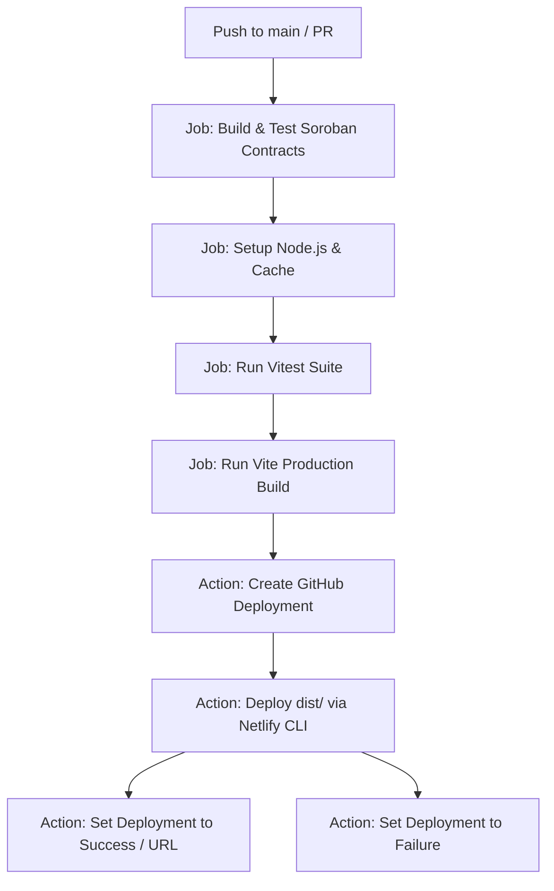

# Deployment Setup & Pipeline Report: TicketChain

This report outlines the deployment setup, GitHub Actions integration, Netlify configuration, and environment configurations established for TicketChain.

---

## 1. Executive Summary

TicketChain's delivery pipeline has been automated to execute testing, building, and publishing on every push to the `main` branch. GitHub Deployments tracking is fully configured to surface environment statuses and history on the repository landing page.

---

## 2. Files Modified
* **[.github/workflows/ci-cd.yml](file:///c:/Users/Arya%20Bhagat/Desktop/ticketchain_/.github/workflows/ci-cd.yml)**: Upgraded pipeline to configure:
  1. Build & Test Soroban smart contracts.
  2. Cache and install Node dependencies.
  3. Run Vitest suites for store regression checking.
  4. Build Vite assets.
  5. Initialize a GitHub Deployment.
  6. Perform non-root local CLI deployments to Netlify.
  7. Publish deployment statuses (`success` or `failure`) with the resulting URL.
* **[README.md](file:///c:/Users/Arya%20Bhagat/Desktop/ticketchain_/README.md)**: Embedded live shields badges to monitor pipeline builds and environment status.

---

## 3. GitHub Actions Pipeline Specification

The workflow is designed as a multi-stage dependency graph:

---

## 4. Netlify Deployment Details

* **Build Location**: `frontend/dist`
* **Netlify Auth Token**: Configured as `${{ secrets.NETLIFY_AUTH_TOKEN }}` in GitHub Secrets.
* **Netlify Site ID**: Configured as `${{ secrets.NETLIFY_SITE_ID }}` in GitHub Secrets.
* **Production Deployment URL**: [https://ticketchain1.netlify.app/](https://ticketchain1.netlify.app/)
* **Local CLI Build**: Done via `npx netlify deploy --prod` (ensuring sandbox compilation matches Netlify's build matrix).

---

## 5. GitHub Environments Integration

The workspace has configured the `production` environment:
* **Environment Display**: Will appear on the right side of the GitHub repository under the **Deployments** panel.
* **Deploy History**: Accessible via the deployment logs tab.
* **Status Checks**: Includes deployment timestamps, commit SHA linkages, and direct launch buttons.
