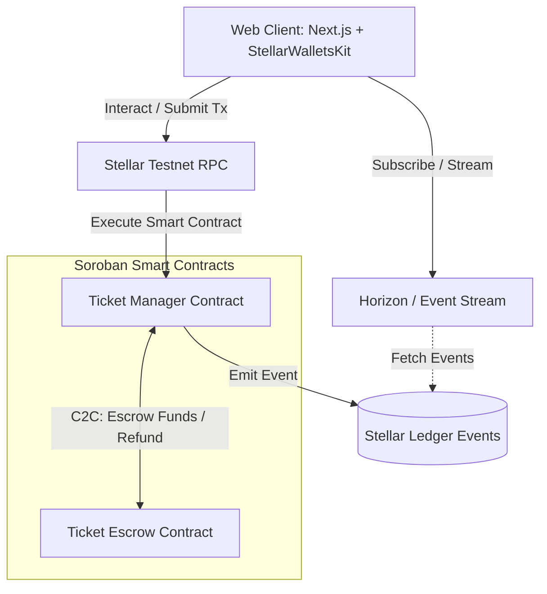
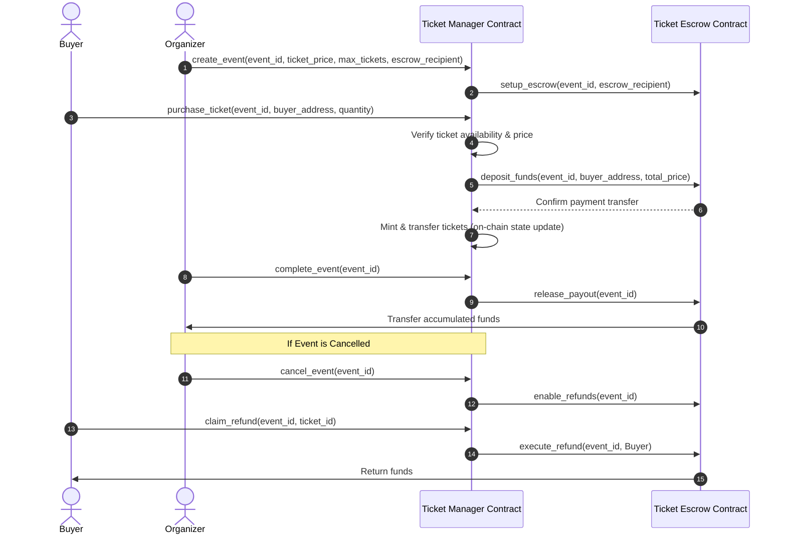

# TicketChain Architecture & System Design

TicketChain is a decentralized ticket management platform built on Stellar using Soroban smart contracts. It guarantees secure, fraud-proof, and transferable event tickets.

## 1. System Architecture

The following diagram illustrates the user interactions, Stellar network integrations, and the relationship between the smart contracts.



---

## 2. Inter-Contract Communication Flow (C2C)

The `Ticket Manager` contract calls the `Ticket Escrow` contract to secure funds during purchases, release funds to organizers post-event, or perform refunds in case of event cancellations.



---

## 3. Directory Layout

The workspace is organized into contracts, frontend application, CI/CD configurations, and deployment scripts:

```
TicketChain/
├── .github/
│   └── workflows/
│       └── ci-cd.yml             # PR validation, linting, testing & deployment
├── contracts/
│   ├── ticket_manager/           # Core ticketing state & rules
│   │   ├── src/
│   │   │   ├── lib.rs
│   │   │   └── types.rs
│   │   └── Cargo.toml
│   ├── ticket_escrow/            # Financial escrow & payout handling
│   │   ├── src/
│   │   │   └── lib.rs
│   │   └── Cargo.toml
│   └── Cargo.toml
├── frontend/
│   ├── src/
│   │   ├── app/                  # Next.js App Router (Landing, Dashboard, etc.)
│   │   ├── components/           # Shared UI elements & Transaction Center
│   │   ├── hooks/                # Wallet & contract hooks
│   │   ├── lib/                  # Services & configuration (wallet-kit, RPC)
│   │   └── store/                # Zustand global states (Activity, Tx Center)
│   ├── package.json
│   ├── tailwind.config.ts
│   └── tsconfig.json
├── scripts/
│   ├── deploy.sh                 # Local & Testnet build/deploy script
│   └── upgrade.sh                # Contract upgrade/migration script
├── architecture.md               # Architecture description
├── .env.example                  # Environment configuration template
└── README.md                     # Production user guide
```

---

## 4. Advanced Soroban Storage & Security Design

- **Custom Storage Pattern**: We implement Temporary, Instance, and Persistent storage types appropriately to manage ledger fees and state expiration:
  - **Instance Storage**: Used for configuration, metadata, and event details (since these require frequent updates and are tied to the contract's lifecycles).
  - **Persistent Storage**: Used for user ticket ownership lookup data (to prevent state from expiring prematurely).
  - **Temporary Storage**: Used for caching temporary validation states (such as signatures, double-spend prevention tokens).
- **Access Control (RBAC)**: Custom administrative ownership is stored in Instance storage. Organizers can define assistants or validation accounts (RBAC) to scan tickets at the gate.
- **Contract Upgradeability**: We include a standard upgrade pattern (`env.deployer().update_current_contract_wasm`) restricted to the contract owner/administrator.
- **Reentrancy Protection**: Financial payouts in `Ticket Escrow` employ a checks-effects-interactions pattern and only accept incoming calls from the registered `Ticket Manager` contract.
