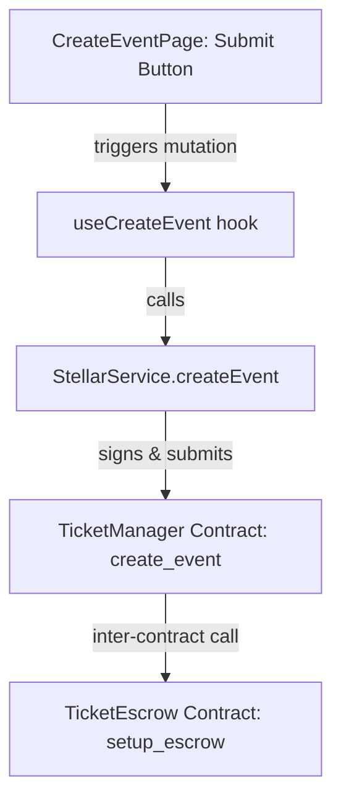
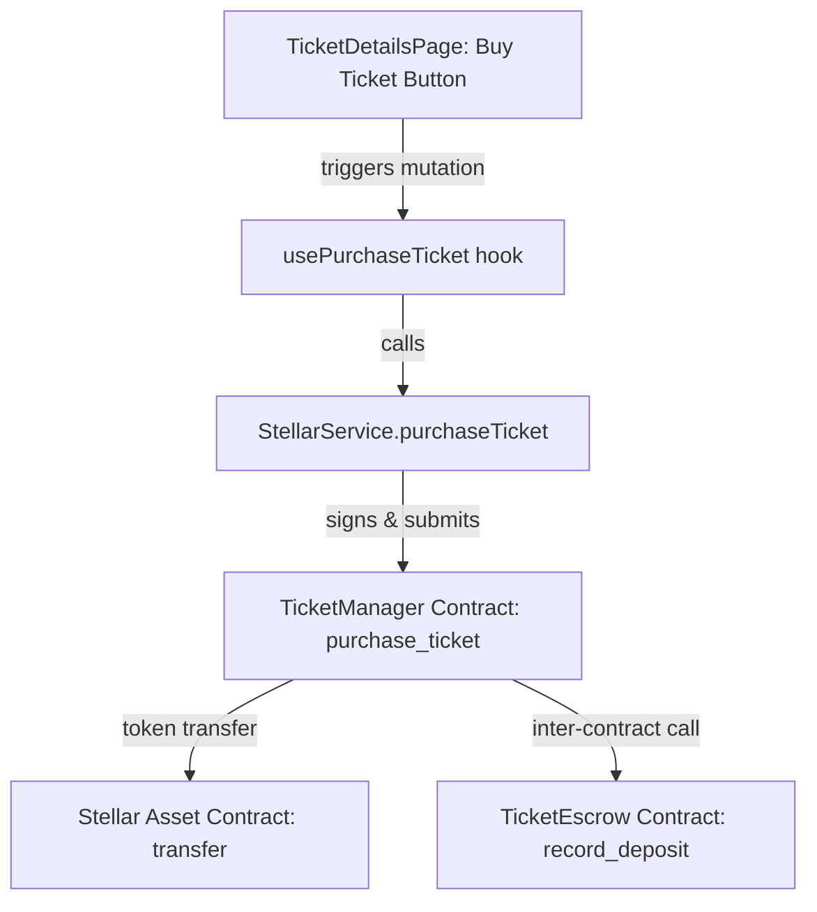
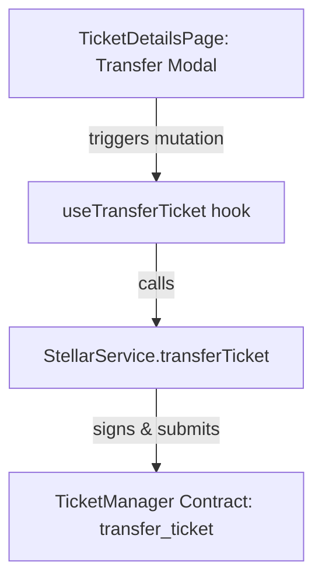
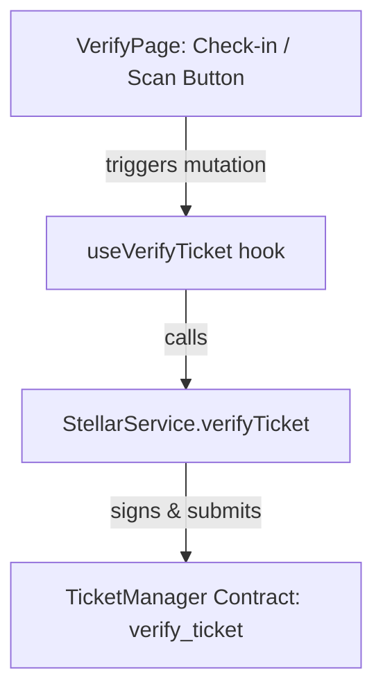
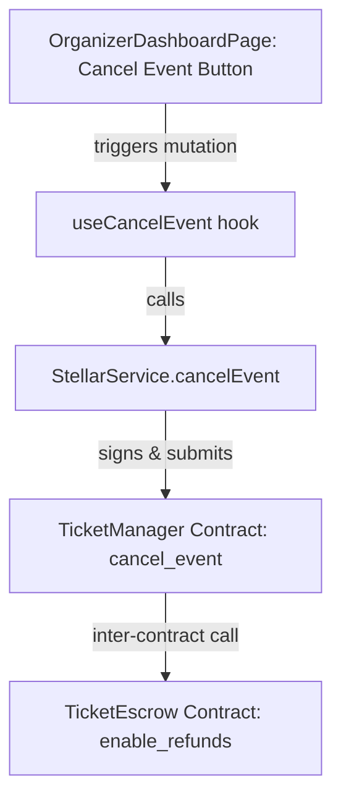
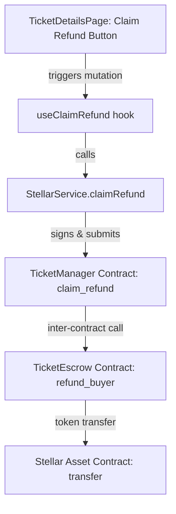
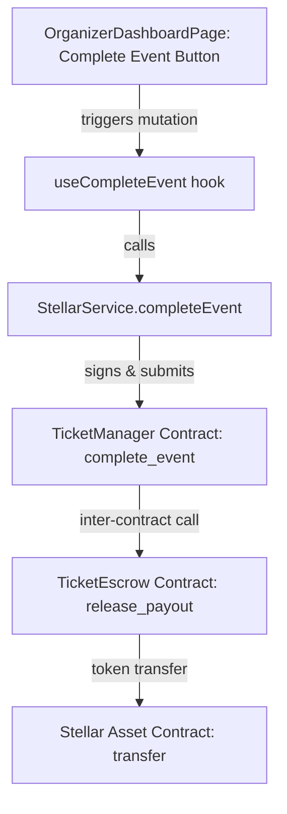

# 🗺️ Contract-Frontend Mapping — TicketChain

This report provides a precise mapping tracing from user interface actions, through custom React hooks and services, to the specific Soroban Smart Contract methods they invoke.

---

## 1. Event Creation Flow

- **Frontend UI Component**: `frontend/src/pages/CreateEventPage.tsx` (Submit Event Form)
- **React Hook**: `useCreateEvent()` in `frontend/src/hooks/useTickets.ts`
- **Stellar Service Function**: `StellarService.createEvent()` in `frontend/src/services/stellar.ts`
- **Target Smart Contract Method**: `TicketManager.create_event(env, organizer, name, ticket_price, max_tickets, date)`
- **Inter-Contract Sub-calls**:
  - `TicketEscrow.setup_escrow(env, event_id, organizer)`: Initializes the escrow vault for the newly generated event ID.

---

## 2. Ticket Purchase Flow

- **Frontend UI Component**: `frontend/src/pages/TicketDetailsPage.tsx` or `ExplorePage.tsx` (Purchase Modal)
- **React Hook**: `usePurchaseTicket()` in `frontend/src/hooks/useTickets.ts`
- **Stellar Service Function**: `StellarService.purchaseTicket()` in `frontend/src/services/stellar.ts`
- **Target Smart Contract Method**: `TicketManager.purchase_ticket(env, buyer, event_id, quantity)`
- **Inter-Contract Sub-calls**:
  - `token::Client.transfer(env, buyer, escrow_address, amount)`: Transfers the token funds from the buyer's account to the Escrow contract's address.
  - `TicketEscrow.record_deposit(env, event_id, buyer, amount)`: Records the buyer's purchase balance in the escrow registry.

---

## 3. Ticket Transfer Flow

- **Frontend UI Component**: `frontend/src/pages/TicketDetailsPage.tsx` (Transfer Ticket Modal)
- **React Hook**: `useTransferTicket()` in `frontend/src/hooks/useTickets.ts`
- **Stellar Service Function**: `StellarService.transferTicket()` in `frontend/src/services/stellar.ts`
- **Target Smart Contract Method**: `TicketManager.transfer_ticket(env, ticket_id, from, to)`

---

## 4. Ticket Verification (Gate Check) Flow

- **Frontend UI Component**: `frontend/src/pages/VerifyPage.tsx` (Scan / Enter Ticket ID Form)
- **React Hook**: `useVerifyTicket()` in `frontend/src/hooks/useTickets.ts`
- **Stellar Service Function**: `StellarService.verifyTicket()` in `frontend/src/services/stellar.ts`
- **Target Smart Contract Method**: `TicketManager.verify_ticket(env, ticket_id, verifier)`

---

## 5. Event Cancellation Flow

- **Frontend UI Component**: `frontend/src/pages/OrganizerDashboardPage.tsx` (Cancel Event Button)
- **React Hook**: `useCancelEvent()` in `frontend/src/hooks/useTickets.ts`
- **Stellar Service Function**: `StellarService.cancelEvent()` in `frontend/src/services/stellar.ts`
- **Target Smart Contract Method**: `TicketManager.cancel_event(env, event_id, organizer)`
- **Inter-Contract Sub-calls**:
  - `TicketEscrow.enable_refunds(env, event_id)`: Transitions the escrow state to `2` (Cancelled/Refundable) enabling ticket holders to claim their funds.

---

## 6. Ticket Refund Flow

- **Frontend UI Component**: `frontend/src/pages/TicketDetailsPage.tsx` (Refund Button for Cancelled Events)
- **React Hook**: `useClaimRefund()` in `frontend/src/hooks/useTickets.ts`
- **Stellar Service Function**: `StellarService.claimRefund()` in `frontend/src/services/stellar.ts`
- **Target Smart Contract Method**: `TicketManager.claim_refund(env, event_id, ticket_id, buyer)`
- **Inter-Contract Sub-calls**:
  - `TicketEscrow.refund_buyer(env, event_id, buyer, amount)`: Verifies buyer deposit, deducts from state, and uses the Stellar Asset Contract client to transfer tokens from the escrow address back to the buyer's address.

---

## 7. Event Completion (Organizer Payout) Flow

- **Frontend UI Component**: `frontend/src/pages/OrganizerDashboardPage.tsx` (Complete Event & Release Funds Button)
- **React Hook**: `useCompleteEvent()` in `frontend/src/hooks/useTickets.ts`
- **Stellar Service Function**: `StellarService.completeEvent()` in `frontend/src/services/stellar.ts`
- **Target Smart Contract Method**: `TicketManager.complete_event(env, event_id, organizer)`
- **Inter-Contract Sub-calls**:
  - `TicketEscrow.release_payout(env, event_id)`: Marks escrow completed, releases all accumulated funds from the escrow address to the organizer's address via the Stellar Asset Contract client.

---

## 8. Summary Table

| Frontend Action | Hook Name | Service Method | Invoked Smart Contract Function | Secondary / Inter-Contract Functions Invoked |
|---|---|---|---|---|
| **Create Event** | `useCreateEvent` | `createEvent` | `TicketManager.create_event` | `TicketEscrow.setup_escrow` |
| **Purchase Ticket** | `usePurchaseTicket` | `purchaseTicket` | `TicketManager.purchase_ticket` | `token::Client.transfer`, `TicketEscrow.record_deposit` |
| **Transfer Ticket** | `useTransferTicket` | `transferTicket` | `TicketManager.transfer_ticket` | *(None)* |
| **Verify Ticket** | `useVerifyTicket` | `verifyTicket` | `TicketManager.verify_ticket` | *(None)* |
| **Cancel Event** | `useCancelEvent` | `cancelEvent` | `TicketManager.cancel_event` | `TicketEscrow.enable_refunds` |
| **Claim Refund** | `useClaimRefund` | `claimRefund` | `TicketManager.claim_refund` | `TicketEscrow.refund_buyer`, `token::Client.transfer` |
| **Complete Event** | `useCompleteEvent` | `completeEvent` | `TicketManager.complete_event` | `TicketEscrow.release_payout`, `token::Client.transfer` |
