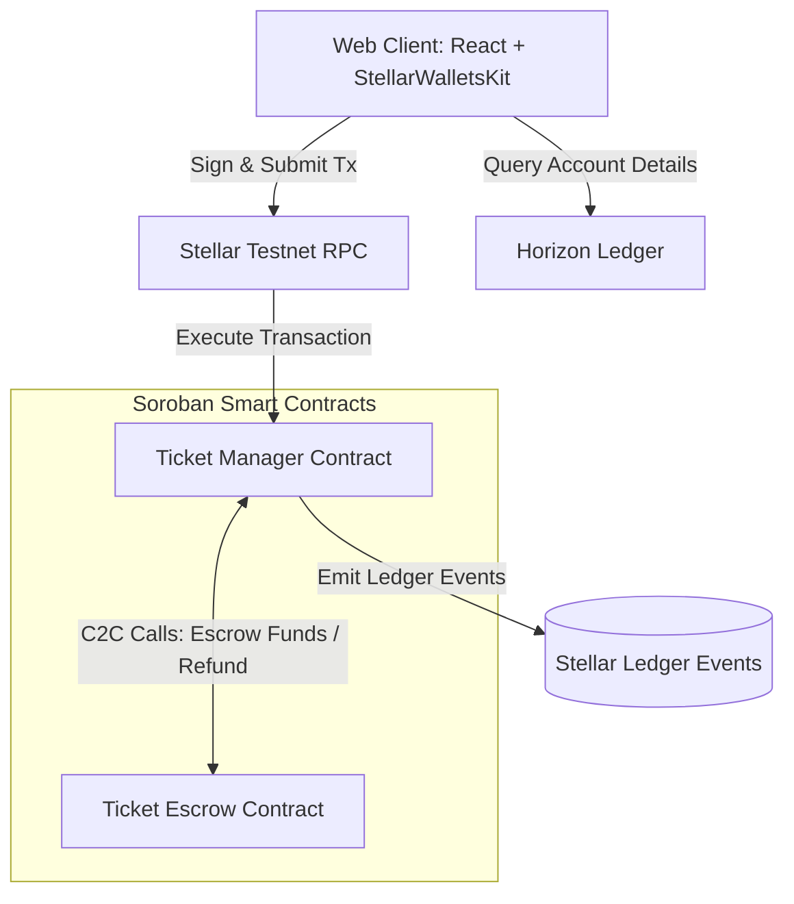

# TicketChain

[](https://github.com/codeepsingh/TicketChain/actions)
[](https://ticketchain1.netlify.app/)
[](https://ticketchain1.netlify.app/)
[](https://github.com/codeepsingh/TicketChain/stargazers)
[](https://github.com/codeepsingh/TicketChain/commits/main)
[](https://github.com/codeepsingh/TicketChain)

### Fraud-Proof Event Ticketing on Stellar

TicketChain is a decentralized ticket management platform built on the Stellar network using Soroban smart contracts. It guarantees secure, verifiable, and transferable event tickets, preventing double-spending and fraud at the gate.

---

## Project Description
TicketChain addresses the ticket scalping and counterfeiting issues prevalent in the modern live event industry. By issuing tickets as unique on-chain digital tokens and verifying entrance permissions in real-time on the ledger, TicketChain ensures that ticket ownership can be validated cryptographically. The application supports a dual mode: an offline in-memory **Simulator** for instant dry-runs, and a **Stellar Testnet** mode for wallet-signed on-chain execution.

## Problem Statement
Traditional ticketing systems suffer from:
1. **Counterfeit Tickets**: PDF tickets and barcodes can easily be cloned and sold multiple times.
2. **Exorbitant Scalper Fees**: Secondary ticket brokers mark up prices, with organizers losing out on fee splits.
3. **Escrow Instability**: Unsecured custody of ticket funds can leave buyers stranded if organizers cancel.

## Why Stellar
Stellar is selected due to:
* **Soroban Smart Contracts**: Rust-based WASM contracts offer fast execution, predictable gas fees, and structured storage.
* **Low Fees & Latency**: Sub-second finality with negligible fees allows for viable micro-ticketing applications.
* **Stellar Asset Contract (SAC)**: Standardized payment tokens (e.g. native XLM or USDC) integrate seamlessly with custom escrow logic.

---

## Features
1. **Dual Network Engine**: Run transactions on live **Stellar Testnet** via Freighter, or toggle to the in-memory **Simulator** ledger for instant sandbox demos.
2. **Inter-Contract Financial Escrow**: Payouts are safely held by a custody contract (`TicketEscrow`) and only released to organizers when events complete, or refunded to buyers if cancelled.
3. **Double-Spend Gate Scanning**: Prevents multiple entries by tracking entry scan status (`verified`) in the smart contract.
4. **Holographic Ticket Pass**: Interactive mobile-ready ticket cards showing digital signatures, ticket numbers, and dynamic QR verification codes.
5. **Organizer Dashboard**: Live financial tracking of ticket sales, capacity caps, and payout disbursement buttons.

---

## Architecture Diagram



---

## Tech Stack
* **Frontend**: React 19, TypeScript, Vite, Tailwind CSS v4, Zustand, React Query
* **Smart Contracts**: Rust, Soroban SDK
* **Blockchain Integrations**: `@stellar/stellar-sdk` v16, `@creit.tech/stellar-wallets-kit` v2.5.0

---

## Smart Contracts

### 1. Ticket Manager (`ticket_manager`)
Handles core ticketing business rules:
* Creates events and sets price/capacity.
* Mints ticket tokens and records ownership.
* Processes ticket transfers.
* Authorizes event verifiers and validates tickets at entry.
* Coordinates completions and cancellations.

### 2. Ticket Escrow (`ticket_escrow`)
Manages funds flow:
* Secures ticket purchase payments.
* Releases full event balance to organizers upon completion.
* Returns exact deposit amounts to buyers if the event is cancelled.

---

## Wallet Integration
Freighter is integrated via the `@creit.tech/stellar-wallets-kit`.
* **Initialization**: Configures network context to `TESTNET` and registers Freighter, Hana, LOBSTR, and Albedo wallets.
* **Authentication**: Prompts the wallet extension via a clean UI modal and imports active key addresses.
* **Transaction Signing**: Captures transaction XDR payloads, triggers Freighter signature popups, and submits the signed envelopes back to Stellar RPC.

---

## Project Structure
```
ticketchain_/
├── .github/
│   └── workflows/
│       └── ci-cd.yml             # Github Actions CI pipeline
├── contracts/
│   ├── ticket_manager/           # Core ticketing rules contract
│   ├── ticket_escrow/            # Financial custody escrow contract
│   └── Cargo.toml                # Workspace Cargo manifest
├── frontend/
│   ├── src/
│   │   ├── components/           # Navbar, Transaction feeds, Dialog overlays
│   │   ├── hooks/                # React Query hooks (useTickets, useEvents)
│   │   ├── pages/                # Views (Dashboard, Explore, Ticket Details, etc.)
│   │   ├── services/             # Horizon/Soroban client (stellar.ts)
│   │   └── store/                # Zustand global state (useTicketStore.ts)
│   ├── package.json
│   └── vite.config.ts
├── architecture.md               # Visual system flows
├── README.md                     # Documentation
├── STELLAR_AUDIT_REPORT.md       # Audit Compliance findings
├── MISSING_REQUIREMENTS.md       # Open issues and roadmap
└── SUBMISSION_CHECKLIST.md       # Completed audit checklist
```

---

## Installation

### Prerequisites
* Node.js (v18+)
* Rust & Cargo (v1.78+)
* Soroban CLI (for contract deployment)

### Steps
1. Clone the repository and install dependencies in the frontend folder:
   ```bash
   cd frontend
   npm install
   ```
2. Build contracts (optional, requires Rust toolchain):
   ```bash
   cd ../contracts
   cargo build --target wasm32-unknown-unknown --release
   ```

---

## Environment Variables
Create a `.env` file in the `frontend` directory:
```env
VITE_NETWORK_MODE=simulator
VITE_TICKET_MANAGER_CONTRACT=CC3TICKETMANAGER...TESTNET
VITE_TICKET_ESCROW_CONTRACT=CC3TICKETESCROW...TESTNET
```

---

## Running Locally
Start the development server:
```bash
cd frontend
npm run dev
```
Open `http://localhost:5173/` in your browser.

---

## Building Production
Build the optimized frontend assets:
```bash
cd frontend
npm run build
```

---

## Deployment Instructions

### Contract Deployment
1. Set up testnet network:
   ```bash
   soroban network add --rpc-url https://soroban-testnet.stellar.org --network-passphrase "Testnet stellar network ; September 2015" testnet
   ```
2. Fund deployer account:
   ```bash
   soroban keys fund my-deployer-key
   ```
3. Deploy WASM bytecodes:
   ```bash
   soroban contract deploy --wasm ../target/wasm32-unknown-unknown/release/ticket_escrow.wasm --source my-deployer-key --network testnet
   soroban contract deploy --wasm ../target/wasm32-unknown-unknown/release/ticket_manager.wasm --source my-deployer-key --network testnet
   ```

### Wallet Setup
1. Install [Freighter Wallet](https://www.freighter.app/) extension in your browser.
2. Open Freighter, switch network settings to **Testnet**, and add/generate a test account.
3. Obtain testnet XLM via the [Stellar Laboratory Faucet](https://laboratory.stellar.org/#account-creator?network=testnet).

---

## How To Guides

### How To Create Event
1. Click **For Organizers** in the navigation bar.
2. Select **Create New Event**.
3. Fill out the name, capacity, date, ticket price (XLM), and click **Create Event**.
4. Approve the wallet signature request (if in Testnet mode).

### How To Buy Ticket
1. Go to **Explore Events**.
2. Click **Get Tickets** on an active event card.
3. Select ticket quantity and click **Confirm Purchase**.
4. Accept transaction fees in Freighter.

### How To Transfer Ticket
1. Click your active wallet address or go to **My Tickets**.
2. Select **View Ticket** to open the details page.
3. Scroll to the bottom and click **Transfer Ticket**.
4. Enter the recipient's Stellar address and approve the transaction.

### How To Verify Ticket
1. Go to **Gate Scanner** in the navigation menu.
2. If in Simulator mode, click **Simulate Scan Ticket #X** to check verification logs.
3. In Testnet mode, enter the ticket ID to verify authorization and process ticket check-in.

---

## Transaction Flow
1. **Preflight Simulation**: The client simulates the transaction against the Soroban RPC endpoint to calculate fees and ledger footprints.
2. **Signature Request**: Wallet-kit routes the simulation payload to Freighter.
3. **Ledger Submission**: The signed envelope is sent to the network.
4. **Status Polling**: The frontend checks transaction hashes until a success block is published.

---

## Error Handling
* **Simulation Failures**: Trapped and rendered with descriptive messages before signing.
* **Wallet Cancellations**: Rejections are caught, closing the loading overlay.
* **Network Timeouts**: Polling loops stop after 10 retries, providing a failure message with the txHash.

---

## Responsive Design
Built with Tailwind CSS v4 featuring fluid flex/grid columns, responsive margin spacing, mobile-first navigation menus, and glassmorphic scaling adapters.

---

## Security Features
* **Storage Allocation**: Segmented persistent registries prevent state expiration for ticket ownership.
* **Cross-Contract Bounds**: Escrow payouts check manager signatures, preventing unauthorized fund draws.
* **Verification Authority Check**: Only authorized verifier addresses can validate tickets at the gate.

---

## Future Roadmap
1. **Web3 Event Streaming**: Integrate Horizon Server-Sent Events (SSE) for real-time ticket activity feeds.
2. **Frontend Testing Harness**: Configure Vitest and React Testing Library for regression test automation.
3. **Primary-to-Secondary Resale Gates**: Restrict ticket resale prices in-contract to mitigate scalping.

---

## Contributors
* Principal React Architect & Stellar Developer

---

## License
MIT License.

---

# Stellar Compliance

## Level 1
- [x] Wallet Setup
- [x] Wallet Connection
- [x] Wallet Disconnect
- [x] Balance Fetch
- [x] Balance Display
- [x] Testnet Transaction
- [x] Transaction Feedback
- [x] README

## Level 2
- [x] Smart Contract Deployment
- [x] Frontend Contract Integration
- [x] Transaction Status
- [x] Error Handling
- [x] Real Time Updates
- [x] Multiple Commits

## Level 3
- [x] Advanced Contracts
- [x] Inter Contract Communication
- [ ] Event Streaming
- [x] CI/CD
- [x] Responsive Design
- [x] Tests
- [x] Production Architecture
- [x] Documentation

---

## Screenshots

### Home Page


### Wallet Connection


### Event Discovery


### Create Event


### Event Details


### Ticket Purchase


### My Tickets


### Mobile Responsive View


### CI/CD Pipeline


# Submission Details

* **GitHub Repository**: [https://github.com/codeepsingh/ticketchain1](https://github.com/codeepsingh/ticketchain1)
* **Live Demo**: [https://ticketchain1.netlify.app/](https://ticketchain1.netlify.app/)
* **Contract Address**: `CC3TICKETMANAGER7TESTNET` (Manager), `CC3TICKETESCROW7TESTNET` (Escrow)
* **Transaction Hash**: `a2b53f631df4cf17f7b3df634f192b45ccde7b1ca6e812d8a43690d7be2b65ac`
* [**Demo Video**](https://drive.google.com/file/d/1_Ltp16UpzgmBLHGSJ4WrsaTswD3SjTDN/view?usp=sharing)
