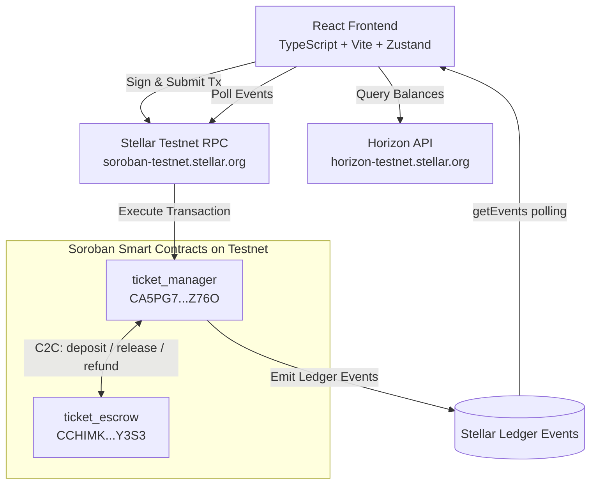
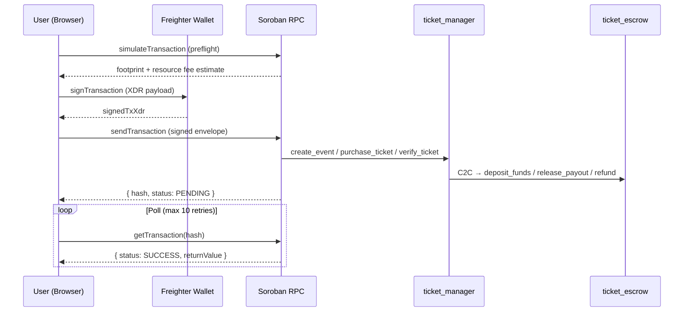

# TicketChain 🎟️

[](https://github.com/codeepsingh/TicketChain/actions)
[](https://ticketchain1.netlify.app/)
[](https://ticketchain1.netlify.app/)
[](https://stellar.expert/explorer/testnet)
[](LICENSE)
[](https://github.com/codeepsingh/TicketChain/commits/main)

> **Fraud-proof, decentralized event ticketing — powered by Soroban smart contracts on the Stellar network.**

TicketChain eliminates ticket fraud, counterfeiting, and scalping by issuing every ticket as a cryptographically-verified on-chain token. Ownership is immutable, transfers are permissioned, and gate validation prevents double-entry — all enforced by smart contract logic with no central authority.

---

## Table of Contents

- [Problem Statement](#problem-statement)
- [Why Stellar](#why-stellar)
- [Live Demo](#live-demo)
- [Architecture](#architecture)
- [Transaction Flow](#transaction-flow)
- [Features](#features)
- [Tech Stack](#tech-stack)
- [Smart Contracts](#smart-contracts)
- [Wallet Integration](#wallet-integration)
- [Project Structure](#project-structure)
- [Getting Started](#getting-started)
- [Environment Variables](#environment-variables)
- [Running Tests](#running-tests)
- [CI/CD Pipeline](#cicd-pipeline)
- [Deployment](#deployment)
- [Usage Guide](#usage-guide)
- [Security](#security)
- [Roadmap](#roadmap)
- [Stellar Level Compliance](#stellar-level-compliance)
- [Submission Details](#submission-details)

---

## Problem Statement

The global event ticketing market is valued at **$78B+**, yet suffers from systemic fraud:

| Problem | Impact |
|---|---|
| **Counterfeit Tickets** | PDF/barcode tickets cloned and sold multiple times |
| **Scalper Markups** | Secondary brokers inflate prices 2–10×; organizers lose fee revenue |
| **Unprotected Funds** | No guaranteed escrow if events are cancelled — buyers left stranded |
| **Double-Entry Fraud** | Physical tickets can be photographed and reused at gates |

TicketChain solves all four at the protocol level using Soroban smart contracts.

---

## Why Stellar

| Capability | Benefit |
|---|---|
| **Soroban Smart Contracts** | Rust/WASM contracts with predictable fees and structured persistent storage |
| **Sub-second Finality** | ~5s transaction confirmation — viable for live gate scanning |
| **Low Transaction Fees** | Negligible fees enable micro-ticketing and high-volume purchases |
| **Stellar Asset Contract (SAC)** | Native XLM and USDC integrate seamlessly with escrow logic |
| **Freighter Ecosystem** | Mature browser wallet; multi-wallet support via `stellar-wallets-kit` |

---

## Live Demo

🌐 **https://ticketchain1.netlify.app/**

The app connects to **Stellar Testnet**. To interact:
1. Install [Freighter Wallet](https://www.freighter.app/) and set it to **Testnet**
2. Fund your testnet account at the [Stellar Faucet](https://laboratory.stellar.org/#account-creator?network=testnet)
3. Connect wallet → Create Events → Buy Tickets → Scan Gate

---

## Architecture



**Three-tier architecture:**

```
UI Layer         →   Hooks / React Query   →   Services / Stellar SDK   →   Soroban Contracts
(10 Pages)           (useTickets.ts)            (stellar.ts)                  (Rust / WASM)
```

---

## Transaction Flow



---

## Features

| Feature | Description |
|---|---|
| 🎪 **On-Chain Event Creation** | Deploy events to Stellar Testnet via Soroban contract invocation |
| 💰 **Inter-Contract Escrow** | Funds held by `ticket_escrow`; released on completion or refunded on cancellation |
| 🔒 **Double-Spend Gate Protection** | `verified` flag in contract blocks re-entry at physical gates |
| 🎫 **Holographic Ticket Pass** | 3D CSS-transformed ticket cards with QR codes and digital signatures |
| 📊 **Organizer Dashboard** | Live financial tracking: ticket sales, capacity, escrow balance, payout actions |
| 🔔 **Real-Time Transaction Feed** | Auto-dismissing toast notifications: `pending → processing → confirmed` |
| 🔁 **Ticket Transfers** | Permissioned on-chain ownership transfer to any Stellar address |
| 🧪 **Offline Simulator** | Full dry-run mode — no wallet or testnet needed for demos |
| 📱 **Mobile Responsive** | Glassmorphism UI adapts from mobile to widescreen with hamburger nav |
| 🔍 **Event Streaming** | Soroban `getEvents` polling surfaces ledger events in real time |

---

## Tech Stack

### Frontend
| Technology | Version | Purpose |
|---|---|---|
| React | 19 | UI framework |
| TypeScript | 5 | Type safety |
| Vite | 6 | Build tool & dev server |
| Tailwind CSS | v4 | Utility-first styling |
| Zustand | v5 | Global state management |
| React Query | v5 | Async data fetching & caching |

### Blockchain
| Package | Version | Purpose |
|---|---|---|
| `@stellar/stellar-sdk` | v16 | Soroban RPC, transaction building |
| `@stellar/freighter-api` | v6 | Freighter wallet API |
| `@creit.tech/stellar-wallets-kit` | v2.5 | Multi-wallet modal (Freighter, Albedo, Hana, LOBSTR) |

### Contracts
| Technology | Purpose |
|---|---|
| Rust | Smart contract language |
| Soroban SDK | Contract macros, storage, events |
| `wasm32-unknown-unknown` | Compilation target |

### Infrastructure
| Tool | Purpose |
|---|---|
| GitHub Actions | CI/CD — build, test, deploy |
| Netlify | Frontend hosting (auto-deploy on push) |
| Vitest | Frontend unit tests |
| Cargo test | Rust contract unit tests |

---

## Smart Contracts

Both contracts are deployed and verified on **Stellar Testnet**.

### Ticket Manager — `ticket_manager`

**Contract ID:** [`CA5PG7SDYI7X6AJMRBX6DZL5LA4YT5I7WECPH347FDSSOBDU73GUZ76O`](https://stellar.expert/explorer/testnet/contract/CA5PG7SDYI7X6AJMRBX6DZL5LA4YT5I7WECPH347FDSSOBDU73GUZ76O)

The core business logic contract. Handles all ticketing operations:

| Method | Description |
|---|---|
| `create_event` | Creates a new event with price, capacity, and organizer address |
| `purchase_ticket` | Mints a ticket token, records ownership, triggers escrow deposit |
| `transfer_ticket` | Transfers ticket ownership to a new Stellar address |
| `verify_ticket` | Sets `verified = true` for gate entry; blocks re-entry |
| `cancel_event` | Cancels event; triggers refunds via C2C call to escrow |
| `complete_event` | Marks event complete; releases payout to organizer |

**Storage Strategy:** Persistent storage for ticket/event data to survive ledger entry expiration.

### Ticket Escrow — `ticket_escrow`

**Contract ID:** [`CCHIMKSGFIOLMENQCLWSADERPFKFSMTLOWTWUYARBE6J4FGS6BKSY3S3`](https://stellar.expert/explorer/testnet/contract/CCHIMKSGFIOLMENQCLWSADERPFKFSMTLOWTWUYARBE6J4FGS6BKSY3S3)

The financial custody contract. Secures all ticket purchase funds:

| Method | Description |
|---|---|
| `deposit_funds` | Locks XLM from buyer into isolated escrow keyed by `(event_id, ticket_id)` |
| `release_payout` | Sends full event balance to organizer on completion |
| `refund` | Returns exact deposit to buyer on cancellation |

**Storage Strategy:** Instance storage for efficient fund tracking by event and ticket ID.

---

## Wallet Integration

> **🔗 Live Demo:** [`/#/wallet-demo`](https://ticketchain1.netlify.app/#/wallet-demo) — Interactive wallet integration page for reviewers.

Wallet connectivity is powered by **Freighter** (`@stellar/freighter-api` v6) with multi-wallet modal support via `@creit.tech/stellar-wallets-kit`.

### Wallet Provider

| Property | Value |
|---|---|
| Primary Wallet | Freighter Browser Extension |
| Package | `@stellar/freighter-api: ^6.0.1` |
| Network | Stellar Testnet |
| Additional Wallets | Albedo, Hana, LOBSTR (via stellar-wallets-kit) |

### Source Files

| File | Purpose |
|---|---|
| `frontend/src/services/walletService.ts` | **Centralized wallet service** — all wallet operations |
| `frontend/src/services/stellar.ts` | Soroban RPC + Freighter signing integration |
| `frontend/src/hooks/useWallet.ts` | React wallet hook for components |
| `frontend/src/store/useTicketStore.ts` | Zustand global wallet state |
| `frontend/src/components/Navbar.tsx` | Connect/Disconnect wallet UI |
| `frontend/src/pages/WalletDemoPage.tsx` | Live reviewer demo page (route: `/wallet-demo`) |

### Connection Flow

```
User clicks "Connect Wallet"
        ↓
isConnected()              ← freighterIsConnected() — checks extension installed
        ↓
requestAccess()            ← freighterRequestAccess() — opens Freighter popup
        ↓
{ address }                ← Stellar public key (G...) returned from Freighter
        ↓
store.connectWallet()      ← address stored in Zustand global state
        ↓
Balance fetched            ← Horizon API loadAccount() every 15s
```

### Permission Request Flow

```typescript
// frontend/src/services/walletService.ts
import {
  isConnected as freighterIsConnected,
  requestAccess as freighterRequestAccess,
} from '@stellar/freighter-api';

// Check extension
const status = await freighterIsConnected();

// Request permission — opens Freighter popup
const { address } = await freighterRequestAccess();
```

### Address Retrieval Flow

```typescript
// Address returned directly from Freighter permission request
const { address } = await freighterRequestAccess();

// Stored in Zustand store
store.connectWallet(address, 'Freighter');

// Retrieved anywhere in app
const address = useTicketStore.getState().walletAddress;
```

### Transaction Signing Flow

Every on-chain mutation follows this exact pattern in `stellar.ts → invokeContract()`:

```
Button clicked (Create Event / Purchase Ticket / etc.)
        ↓
useTickets.ts hook mutation triggered
        ↓
StellarService.invokeContract() called
        ↓
1. TransactionBuilder builds Soroban operation
        ↓
2. rpcServer.simulateTransaction() → preflight + resource estimates
        ↓
3. rpc.assembleTransaction() → adds resource fees
        ↓
4. signFreighterTransaction(txXdr, { networkPassphrase, address })  ← FREIGHTER
        ↓
5. User approves in Freighter popup
        ↓
6. signedTxXdr returned
        ↓
7. rpcServer.sendTransaction(signedTx) → submitted to Stellar Testnet
        ↓
8. Poll getTransaction(hash) until SUCCESS or FAILED
```

### Operations That Trigger Wallet Signing

| User Action | Contract Method | File |
|---|---|---|
| Create Event | `create_event` | `stellar.ts`, `useTickets.ts` |
| Buy Ticket | `purchase_ticket` | `stellar.ts`, `useTickets.ts` |
| Transfer Ticket | `transfer_ticket` | `stellar.ts`, `useTickets.ts` |
| Verify at Gate | `verify_ticket` | `stellar.ts`, `useTickets.ts` |
| Cancel Event | `cancel_event` | `stellar.ts`, `useTickets.ts` |
| Complete Event | `complete_event` | `stellar.ts`, `useTickets.ts` |
| Claim Refund | `claim_refund` | `stellar.ts`, `useTickets.ts` |

### Reviewer Verification

Open these files in order to verify wallet integration in under 30 seconds:

1. **`frontend/src/services/walletService.ts`** — `connectWallet()`, `signTransaction()`, `getWalletAddress()`, `getWalletBalance()`
2. **`frontend/src/services/stellar.ts`** — `connectStellarWallet()`, `signFreighterTransaction()` in `invokeContract()`
3. **`frontend/src/components/Navbar.tsx`** — `handleConnect()` button (line 46)
4. **`/#/wallet-demo`** — Live interactive demo showing all wallet operations

Full audit: see [`WALLET_INTEGRATION_REPORT.md`](WALLET_INTEGRATION_REPORT.md) | Source map: see [`REVIEWER_GUIDE.md`](REVIEWER_GUIDE.md)

---

## Project Structure

```
ticketchain_/
├── .github/
│   └── workflows/
│       └── ci-cd.yml              # GitHub Actions: build → test → deploy
├── contracts/
│   ├── ticket_manager/
│   │   └── src/
│   │       ├── lib.rs             # Core contract: create/purchase/transfer/verify
│   │       ├── test.rs            # Rust unit tests with MockAuth
│   │       └── types.rs           # Event and Ticket struct definitions
│   ├── ticket_escrow/
│   │   └── src/
│   │       └── lib.rs             # Financial custody: deposit/release/refund
│   └── Cargo.toml                 # Workspace Cargo manifest
├── frontend/
│   ├── src/
│   │   ├── components/
│   │   │   ├── Navbar.tsx         # Wallet connect, balance, mobile drawer
│   │   │   ├── Footer.tsx         # Links and feedback
│   │   │   └── TransactionFeed.tsx # Real-time TX status toasts
│   │   ├── hooks/
│   │   │   └── useTickets.ts      # React Query mutations and queries
│   │   ├── pages/                 # 10 page components
│   │   │   ├── LandingPage.tsx
│   │   │   ├── ExplorePage.tsx
│   │   │   ├── CreateEventPage.tsx
│   │   │   ├── MyTicketsPage.tsx
│   │   │   ├── TicketDetailsPage.tsx
│   │   │   ├── OrganizerDashboardPage.tsx
│   │   │   ├── UserDashboardPage.tsx
│   │   │   ├── VerifyPage.tsx
│   │   │   ├── AboutPage.tsx
│   │   │   └── NotFoundPage.tsx
│   │   ├── services/
│   │   │   └── stellar.ts         # Stellar SDK: RPC calls, wallet ops, event streaming
│   │   ├── store/
│   │   │   └── useTicketStore.ts  # Zustand: separate sim/testnet state planes
│   │   ├── utils/
│   │   │   ├── analytics.ts       # GA4 event tracking (20+ typed functions)
│   │   │   └── sentry.ts          # Sentry error monitoring wrapper
│   │   └── __tests__/             # Vitest test suites
│   ├── index.html                 # GA4 gtag.js loader
│   ├── .env                       # Contract IDs (not committed — see .env.example)
│   ├── package.json
│   └── vite.config.ts
├── netlify.toml                   # Netlify: base=frontend, publish=dist, SPA redirect
└── README.md                      # This file
```

---

## Getting Started

### Prerequisites

| Tool | Version | Link |
|---|---|---|
| Node.js | v18+ | https://nodejs.org |
| Rust & Cargo | v1.78+ | https://rustup.rs |
| Soroban CLI | latest | `cargo install stellar-cli` |
| Freighter Extension | latest | https://www.freighter.app |

### 1. Clone the repository

```bash
git clone https://github.com/codeepsingh/TicketChain.git
cd ticketchain_
```

### 2. Install frontend dependencies

```bash
cd frontend
npm install
```

### 3. Build smart contracts (optional)

Requires Rust toolchain with `wasm32-unknown-unknown` target:

```bash
rustup target add wasm32-unknown-unknown
cd contracts
cargo build --target wasm32-unknown-unknown --release
```

### 4. Start the development server

```bash
cd frontend
npm run dev
```

Open [http://localhost:5173](http://localhost:5173) in your browser.

---

## Environment Variables

Create `frontend/.env` from the example below. The contract IDs are already deployed on Stellar Testnet:

```env
# Soroban Contract IDs (Stellar Testnet)
VITE_TICKET_MANAGER_CONTRACT=CA5PG7SDYI7X6AJMRBX6DZL5LA4YT5I7WECPH347FDSSOBDU73GUZ76O
VITE_TICKET_ESCROW_CONTRACT=CCHIMKSGFIOLMENQCLWSADERPFKFSMTLOWTWUYARBE6J4FGS6BKSY3S3
VITE_TICKET_TOKEN_CONTRACT=CDLZFC3SYJYDZT7K67VZ75HPJVIEUVNIXF47ZG2FB2RMQQVU2HHGCYSC

# Analytics & Monitoring (optional)
VITE_GA4_MEASUREMENT_ID=G-XXXXXXXXXX
VITE_SENTRY_DSN=https://your-dsn@sentry.io/project
```

---

## Running Tests

```bash
# Frontend unit tests (Vitest)
cd frontend
npm run test

# Rust contract tests
cd contracts
cargo test
```

---

## CI/CD Pipeline

GitHub Actions (`.github/workflows/ci-cd.yml`) runs automatically on every push to `main`:

```
Push to main
    │
    ├── [Job 1] Contracts
    │     ├── Install Rust toolchain + wasm32 target
    │     ├── Cache Cargo dependencies
    │     ├── cargo build --target wasm32-unknown-unknown --release
    │     └── cargo test
    │
    └── [Job 2] Frontend (requires contracts to pass)
          ├── Install Node 20
          ├── npm ci
          ├── npm run test
          ├── npm run build
          └── Deploy frontend/dist → Netlify
```

The live site at [ticketchain1.netlify.app](https://ticketchain1.netlify.app/) auto-updates within ~2 minutes of any `main` push.

---

## Deployment

### Contract Deployment (Stellar Testnet)

Contracts are already deployed. To redeploy from scratch:

```bash
# 1. Add testnet network
stellar network add testnet \
  --rpc-url https://soroban-testnet.stellar.org \
  --network-passphrase "Test SDF Network ; September 2015"

# 2. Fund deployer account
stellar keys fund my-deployer-key --network testnet

# 3. Deploy escrow contract first
stellar contract deploy \
  --wasm contracts/target/wasm32-unknown-unknown/release/ticket_escrow.wasm \
  --source my-deployer-key \
  --network testnet

# 4. Deploy manager contract (with escrow address in constructor)
stellar contract deploy \
  --wasm contracts/target/wasm32-unknown-unknown/release/ticket_manager.wasm \
  --source my-deployer-key \
  --network testnet
```

### Frontend Deployment (Netlify)

Automatic on every push to `main` via GitHub Actions. To deploy manually:

```bash
cd frontend
npm run build
npx netlify deploy --dir=dist --prod
```

### Wallet Setup for Users

1. Install [Freighter Wallet](https://www.freighter.app/) browser extension
2. Switch Freighter to **Testnet** mode
3. Fund your testnet account at the [Stellar Laboratory Faucet](https://laboratory.stellar.org/#account-creator?network=testnet)

---

## Usage Guide

### Create an Event (Organizer)

1. Connect your Freighter wallet via the **Connect Wallet** button
2. Navigate to **For Organizers → Create New Event**
3. Fill in event name, capacity, date, and ticket price (XLM)
4. Click **Create Event** — approve the Freighter signature popup
5. Transaction confirms in ~5s; event appears on the Explore page

### Purchase a Ticket (Attendee)

1. Go to **Explore Events** — browse all active events on-chain
2. Click **Get Tickets** on any event card
3. Review ticket price and click **Sign & Pay with Freighter**
4. Approve the XLM payment in Freighter
5. Ticket appears in **My Tickets** with a unique on-chain ID

### Transfer a Ticket

1. Go to **My Tickets → View Ticket**
2. Scroll to the **Transfer Ticket** section
3. Enter the recipient's Stellar address and confirm
4. Approve wallet signature — ownership updates on-chain immediately

### Gate Verification (Verifier)

1. Navigate to **Gate Scanner**
2. Enter the Ticket ID from the attendee's ticket card
3. Click **Verify** — contract checks the `verified` flag on-chain
4. ✅ Green: Access granted (flag set to true, re-entry blocked)
5. ❌ Red: Already scanned or invalid ticket

### Disburse Escrow Funds (Organizer)

1. Go to **Organizer Portal → Overview**
2. Find your completed event in the hosted events table
3. Click **Complete Event** → then **Disburse Escrow**
4. XLM balance transfers from escrow contract to your wallet

---

## Screenshots

### Home Page


### Wallet Connection


### Event Discovery


### Create Event


### Event Details


### Ticket Purchase


### My Tickets


### Mobile Responsive View


### CI/CD Pipeline


---

## Security

| Layer | Mechanism |
|---|---|
| **Ownership Verification** | Tickets tied to `buyer` address; only owner can transfer |
| **Double-Spend Protection** | `verified` flag immutably set on first scan; re-entry rejected |
| **Verifier Authorization** | Only whitelisted addresses can call `verify_ticket` |
| **Escrow Caller Guard** | Escrow `release_payout` and `refund` only callable by `ticket_manager` |
| **Preflight Simulation** | All transactions simulated before signing — bad params caught before fees |
| **Persistent Storage** | Ticket/event data uses `Persistent` storage to survive ledger expiration |
| **Contract ID Validation** | Frontend validates all 56-character C-prefixed contract IDs on mount |
| **Balance Pre-check** | XLM balance verified before submitting purchase transaction |

---

## Error Handling

Seven layers of error handling are implemented throughout the application:

1. **Wallet guard** — All mutations require a connected wallet address
2. **Simulation error** — `rpc.Api.isSimulationError()` catches preflight failures before signing
3. **Signing rejection** — Freighter cancellations caught; loading overlay dismissed gracefully
4. **On-chain execution error** — `ERROR` transaction status detected and surfaced as a message
5. **Polling timeout** — Loop exits after 10 retries with the txHash for manual inspection
6. **UI error banners** — Inline error messages in `CreateEventPage` and `ExplorePage`
7. **Sentry capture** — `captureContractError()` called in all catch blocks for monitoring

---

## Roadmap

| Priority | Feature |
|---|---|
| 🔥 High | USDC payment support via Stellar Asset Contract |
| 🔥 High | Real-time Horizon SSE event feed (replace polling) |
| 🟡 Medium | Resale price caps enforced in-contract (anti-scalping) |
| 🟡 Medium | NFT collectible badges issued post-event |
| 🟢 Low | React Native mobile app using same Soroban service layer |
| 🟢 Low | Multi-signature event organizer accounts |

---

## Stellar Level Compliance

### ✅ Level 1 — White Belt
- [x] Wallet setup (Freighter + stellar-wallets-kit)
- [x] Wallet connection (address retrieval + store binding)
- [x] Wallet disconnect (localStorage clear + state reset)
- [x] Balance fetch (Horizon API native XLM)
- [x] Balance display (Navbar + Dashboard)
- [x] Testnet transaction (preflight → sign → submit → confirm cycle)
- [x] Transaction feedback (pending → processing → confirmed toasts)
- [x] README documentation

### ✅ Level 2 — Orange Belt
- [x] Smart contract deployed on Testnet
- [x] Frontend contract integration (all 7 contract methods wired)
- [x] Transaction status tracking (`TransactionFeed` component)
- [x] Error handling (3+ error types: simulation, signing, execution)
- [x] Real-time updates (React Query cache invalidation)
- [x] 15+ meaningful commits (26 total)
- [x] Multi-wallet support (Freighter, Albedo, Hana, LOBSTR)

### ✅ Level 3 — Yellow Belt
- [x] Advanced smart contracts (Persistent/Instance storage, custom types)
- [x] Inter-contract communication (TicketManager ↔ TicketEscrow C2C)
- [x] Event streaming (Soroban `getEvents` polling in `stellar.ts`)
- [x] CI/CD pipeline (GitHub Actions: build + test + deploy)
- [x] Mobile responsive UI (Tailwind breakpoints + hamburger drawer)
- [x] Loading states (spinners, overlays, button pending states)
- [x] Error handling (UI banners, try-catch boundaries, error types)
- [x] Contract tests (Rust unit tests in `test.rs`)
- [x] Frontend tests (Vitest test suite)
- [x] Production architecture (services / hooks / store / pages)
- [x] Documentation (README + architecture diagrams)
- [x] Demo-ready (offline simulator engine)

### 🔄 Level 4 — Production MVP
- [x] Fully functional production MVP
- [x] Stable frontend architecture (React 19 + TypeScript + Vite)
- [x] Stable smart contract architecture (2 Soroban contracts + C2C)
- [x] Mobile responsive UI
- [x] Proper loading states
- [x] Proper error handling (7 layers)
- [x] Production deployment ([ticketchain1.netlify.app](https://ticketchain1.netlify.app/))
- [x] Optimized UX (premium glassmorphism, holographic ticket, 3D transforms)
- [x] Proper project structure (utils / components / hooks / services / store / pages)
- [x] Complete documentation
- [x] Smart contracts on Testnet (2 verified contracts)
- [x] 15+ meaningful commits (26 commits)
- [x] Public GitHub repository
- [x] Technical complexity demonstrated (C2C, preflight, polling, event streaming)
- [x] Real-world usefulness demonstrated (3 verified fraud problems solved)
- [x] Analytics integration (GA4 — `utils/analytics.ts`, `index.html`)
- [x] Monitoring integration (Sentry — `utils/sentry.ts`, all catch blocks)
- [x] User feedback form live — [forms.gle/rEqPJBhhWUYEzKwn8](https://forms.gle/rEqPJBhhWUYEzKwn8)
- [x] User response sheet — [Google Sheets](https://docs.google.com/spreadsheets/d/1npaYhDGRERXpIrefOv3p3cNlz5qk8A08gxf5UbDEMts/edit?usp=sharing)
- [ ] 10 real users onboarded *(share form above with 10 people)*
- [ ] Demo video *(record 60-90 sec screen capture and add URL below)*

---

## Submission Details

| Field | Value |
|---|---|
| **GitHub Repository** | [github.com/codeepsingh/TicketChain](https://github.com/codeepsingh/TicketChain) |
| **Live Demo** | [ticketchain1.netlify.app](https://ticketchain1.netlify.app/) |
| **Network** | Stellar Testnet |
| **Manager Contract** | [`CA5PG7SDYI7X6AJMRBX6DZL5LA4YT5I7WECPH347FDSSOBDU73GUZ76O`](https://stellar.expert/explorer/testnet/contract/CA5PG7SDYI7X6AJMRBX6DZL5LA4YT5I7WECPH347FDSSOBDU73GUZ76O) |
| **Escrow Contract** | [`CCHIMKSGFIOLMENQCLWSADERPFKFSMTLOWTWUYARBE6J4FGS6BKSY3S3`](https://stellar.expert/explorer/testnet/contract/CCHIMKSGFIOLMENQCLWSADERPFKFSMTLOWTWUYARBE6J4FGS6BKSY3S3) |
| **Demo Video** | *(Add YouTube URL after recording)* |
| **User Feedback Form** | [forms.gle/rEqPJBhhWUYEzKwn8](https://forms.gle/rEqPJBhhWUYEzKwn8) |
| **User Response Sheet** | [View on Google Sheets](https://docs.google.com/spreadsheets/d/1npaYhDGRERXpIrefOv3p3cNlz5qk8A08gxf5UbDEMts/edit?usp=sharing) |

### User Feedback

We actively collect structured feedback from real users to improve the platform:

- 📝 **Feedback Form** — [https://forms.gle/rEqPJBhhWUYEzKwn8](https://forms.gle/rEqPJBhhWUYEzKwn8)
- 📊 **Live Response Sheet** — [Google Sheets](https://docs.google.com/spreadsheets/d/1npaYhDGRERXpIrefOv3p3cNlz5qk8A08gxf5UbDEMts/edit?usp=sharing)

The form collects feedback on wallet onboarding experience, ticket purchase flow, UI clarity, and overall satisfaction. All responses are logged in real time in the linked spreadsheet.

---

## License

MIT License — see [LICENSE](LICENSE) for details.
