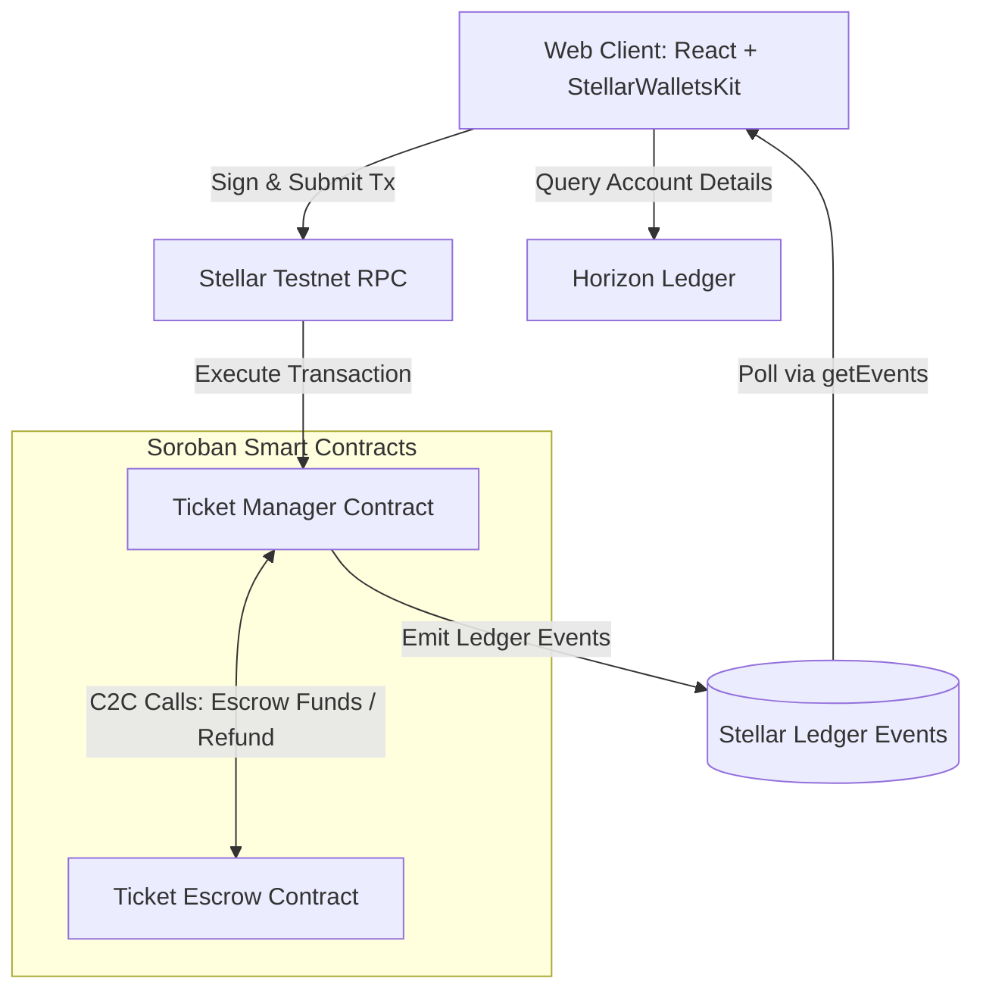
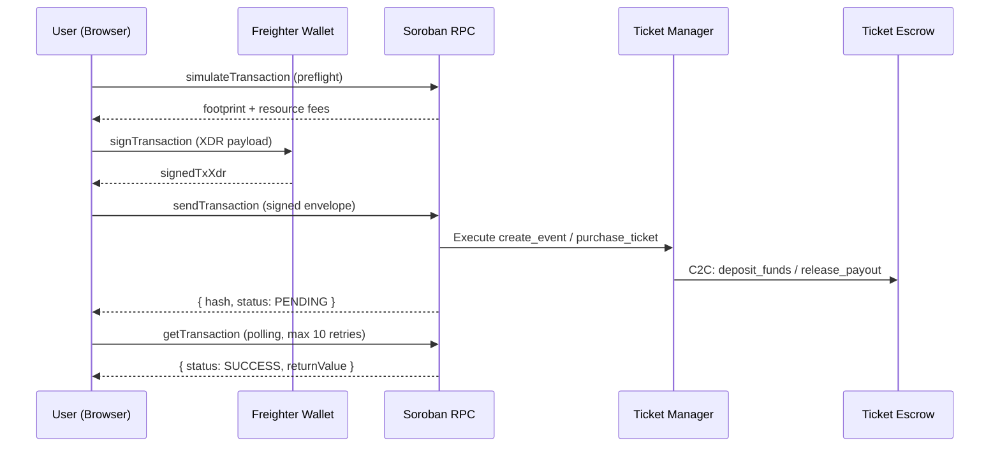

# TicketChain

[](https://github.com/codeepsingh/TicketChain/actions)
[](https://ticketchain1.netlify.app/)
[](https://ticketchain1.netlify.app/)
[](https://github.com/codeepsingh/TicketChain/stargazers)
[](https://github.com/codeepsingh/TicketChain/commits/main)
[](https://github.com/codeepsingh/TicketChain)

### Fraud-Proof Event Ticketing on Stellar

TicketChain is a decentralized ticket management platform built on the Stellar network using Soroban smart contracts. It guarantees secure, verifiable, and transferable event tickets, preventing double-spending and fraud at the gate.

---

## Project Description

TicketChain addresses the ticket scalping and counterfeiting issues prevalent in the modern live event industry. By issuing tickets as unique on-chain digital tokens and verifying entrance permissions in real-time on the ledger, TicketChain ensures that ticket ownership can be validated cryptographically. The application supports a dual mode: an offline in-memory **Simulator** for instant dry-runs, and a **Stellar Testnet** mode for wallet-signed on-chain execution.

---

## Problem Statement

Traditional ticketing systems suffer from:

1. **Counterfeit Tickets**: PDF tickets and barcodes can easily be cloned and sold multiple times.
2. **Exorbitant Scalper Fees**: Secondary ticket brokers mark up prices, with organizers losing out on fee splits.
3. **Escrow Instability**: Unsecured custody of ticket funds can leave buyers stranded if organizers cancel.

---

## Why Stellar

Stellar is selected due to:

* **Soroban Smart Contracts**: Rust-based WASM contracts offer fast execution, predictable gas fees, and structured storage.
* **Low Fees & Latency**: Sub-second finality with negligible fees allows for viable micro-ticketing applications.
* **Stellar Asset Contract (SAC)**: Standardized payment tokens (e.g. native XLM) integrate seamlessly with custom escrow logic.
* **Freighter Ecosystem**: Mature browser wallet with `@creit.tech/stellar-wallets-kit` multi-wallet support.

---

## Architecture Diagram



---

## Transaction Flow



---

## Features

1. **On-Chain Event Creation**: Deploy new events directly to the Stellar Testnet via Soroban contract invocation.
2. **Inter-Contract Financial Escrow**: Payouts are safely held by a custody contract (`TicketEscrow`) and only released to organizers when events complete, or refunded to buyers if cancelled.
3. **Double-Spend Gate Scanning**: Prevents multiple entries by tracking entry scan status (`verified`) in the smart contract.
4. **Holographic Ticket Pass**: Interactive mobile-ready ticket cards showing digital signatures, ticket numbers, and dynamic QR verification codes.
5. **Organizer Dashboard**: Live financial tracking of ticket sales, capacity caps, and payout disbursement buttons.
6. **Real-Time Transaction Feed**: Auto-dismissing status notifications for all on-chain interactions (pending → processing → confirmed).
7. **Simulator Engine**: Full offline dry-run mode for testing without wallet or testnet access.

---

## Tech Stack

* **Frontend**: React 19, TypeScript, Vite 8, Tailwind CSS v4, Zustand v5, React Query v5
* **Smart Contracts**: Rust, Soroban SDK
* **Blockchain Integrations**: `@stellar/stellar-sdk` v16, `@stellar/freighter-api` v6, `@creit.tech/stellar-wallets-kit` v2.5.0
* **Testing**: Vitest (frontend), Cargo test (contracts)
* **CI/CD**: GitHub Actions
* **Hosting**: Netlify

---

## Smart Contracts

### 1. Ticket Manager (`ticket_manager`)

**Contract ID:** `CA5PG7SDYI7X6AJMRBX6DZL5LA4YT5I7WECPH347FDSSOBDU73GUZ76O`

Handles core ticketing business rules:
* Creates events and sets price/capacity.
* Mints ticket tokens and records ownership using **Persistent** storage.
* Processes ticket transfers with ownership verification.
* Authorizes event verifiers and validates tickets at entry with double-spend protection.
* Coordinates completions and cancellations via C2C calls to the escrow contract.

### 2. Ticket Escrow (`ticket_escrow`)

**Contract ID:** `CCHIMKSGFIOLMENQCLWSADERPFKFSMTLOWTWUYARBE6J4FGS6BKSY3S3`

Manages funds flow:
* Secures ticket purchase payments in isolated escrow deposits.
* Releases full event balance to organizers upon completion.
* Returns exact deposit amounts to buyers if the event is cancelled.
* Uses **Instance** storage for efficient fund tracking by event and ticket ID.

---

## Wallet Integration

Freighter is integrated via `@stellar/freighter-api` and `@creit.tech/stellar-wallets-kit`:
* **Initialization**: Configures network context to `TESTNET` and registers Freighter, Hana, LOBSTR, and Albedo wallets.
* **Authentication**: Prompts the wallet extension via a clean UI modal and imports active key addresses.
* **Transaction Signing**: Captures transaction XDR payloads, triggers Freighter signature popups, and submits the signed envelopes back to Stellar RPC.
* **Balance Sync**: Polls Horizon API every 15 seconds to keep XLM balance up-to-date.

---

## Project Structure

```
ticketchain_/
├── .github/
│   └── workflows/
│       └── ci-cd.yml             # GitHub Actions CI/CD pipeline
├── contracts/
│   ├── ticket_manager/
│   │   └── src/
│   │       ├── lib.rs            # Core business logic (create/purchase/transfer/verify)
│   │       ├── test.rs           # Rust unit tests with MockAuth
│   │       └── types.rs          # Event and Ticket struct definitions
│   ├── ticket_escrow/
│   │   └── src/
│   │       └── lib.rs            # Financial custody (deposit/release/refund)
│   └── Cargo.toml                # Workspace Cargo manifest
├── frontend/
│   ├── src/
│   │   ├── components/           # Navbar, Footer, TransactionFeed
│   │   ├── hooks/useTickets.ts   # React Query mutations and queries
│   │   ├── pages/                # 10 page components
│   │   ├── services/stellar.ts   # Stellar SDK service layer
│   │   ├── store/                # Zustand global state
│   │   └── __tests__/            # Vitest test suites
│   ├── .env                      # Testnet contract IDs
│   ├── package.json
│   └── vite.config.ts
├── LEVEL4_AUDIT_REPORT.md        # Level 4 compliance audit
├── LEVEL4_MISSING_ITEMS.md       # Outstanding items for Level 4
├── LEVEL4_SUBMISSION_CHECKLIST.md # Final submission checklist
├── USER_ONBOARDING_CHECKLIST.md  # 10-user onboarding records
├── ANALYTICS_SETUP_REPORT.md     # Analytics & monitoring setup guide
├── architecture.md               # Mermaid system flow diagrams
├── netlify.toml                  # Netlify deployment config
└── README.md                     # This file
```

---

## Installation

### Prerequisites

* Node.js (v18+)
* Rust & Cargo (v1.78+)
* Soroban CLI (for contract deployment)
* Freighter browser extension (https://www.freighter.app/)

### Steps

1. Clone the repository:
   ```bash
   git clone https://github.com/codeepsingh/TicketChain.git
   cd ticketchain_
   ```

2. Install frontend dependencies:
   ```bash
   cd frontend
   npm install
   ```

3. Build contracts (optional, requires Rust toolchain):
   ```bash
   cd ../contracts
   cargo build --target wasm32-unknown-unknown --release
   ```

---

## Environment Variables

Create or verify `frontend/.env`:

```env
VITE_TICKET_MANAGER_CONTRACT=CA5PG7SDYI7X6AJMRBX6DZL5LA4YT5I7WECPH347FDSSOBDU73GUZ76O
VITE_TICKET_ESCROW_CONTRACT=CCHIMKSGFIOLMENQCLWSADERPFKFSMTLOWTWUYARBE6J4FGS6BKSY3S3
VITE_TICKET_TOKEN_CONTRACT=CDLZFC3SYJYDZT7K67VZ75HPJVIEUVNIXF47ZG2FB2RMQQVU2HHGCYSC
```

---

## Running Locally

Start the development server:

```bash
cd frontend
npm run dev
```

Open `http://localhost:5173/` in your browser.

---

## Running Tests

```bash
# Frontend tests
cd frontend
npm run test

# Contract tests
cd contracts
cargo test
```

---

## Building Production

```bash
cd frontend
npm run build
```

Output is in `frontend/dist/`.

---

## Deployment Instructions

### Contract Deployment

1. Set up testnet network:
   ```bash
   stellar network add --rpc-url https://soroban-testnet.stellar.org --network-passphrase "Test SDF Network ; September 2015" testnet
   ```

2. Fund deployer account:
   ```bash
   stellar keys fund my-deployer-key --network testnet
   ```

3. Deploy WASM bytecodes:
   ```bash
   stellar contract deploy --wasm ../target/wasm32-unknown-unknown/release/ticket_escrow.wasm --source my-deployer-key --network testnet
   stellar contract deploy --wasm ../target/wasm32-unknown-unknown/release/ticket_manager.wasm --source my-deployer-key --network testnet
   ```

### Frontend Deployment (Netlify)

1. Push to `main` branch — GitHub Actions automatically builds and deploys
2. Manual deploy:
   ```bash
   npx netlify deploy --dir=frontend/dist --prod
   ```

### Wallet Setup

1. Install [Freighter Wallet](https://www.freighter.app/) extension.
2. Switch Freighter to **Testnet** mode.
3. Fund your testnet account at [Stellar Laboratory Faucet](https://laboratory.stellar.org/#account-creator?network=testnet).

---

## Usage Guide

### How To Create Event

1. Click **For Organizers** in the navigation bar.
2. Select **Create New Event**.
3. Fill out the name, capacity, date, ticket price (XLM), and click **Create Event**.
4. Approve the wallet signature request in Freighter.
5. Transaction confirms in ~5 seconds; event appears in Explore page.

### How To Buy Ticket

1. Go to **Explore Events**.
2. Click **Get Tickets** on an active event card.
3. Select ticket quantity and click **Sign & Pay with Freighter**.
4. Accept transaction fee prompt in Freighter.
5. Ticket appears in **My Tickets** dashboard.

### How To Transfer Ticket

1. Go to **My Tickets**.
2. Select **View Ticket** to open the details page.
3. Scroll to **Transfer Ticket** section.
4. Enter the recipient's Stellar address and confirm.
5. Approve wallet signature; ticket ownership updates on-chain.

### How To Verify Ticket

1. Go to **Gate Scanner** in the navigation menu.
2. Enter the Ticket ID manually in the validation form.
3. Click **Verify** — the gate checks the on-chain `verified` flag.
4. Green panel: Access granted. Red panel: Already scanned or cancelled.

### How To Disburse Escrow (Organizer)

1. Go to **Organizer Portal** → **Overview**.
2. Find the completed event in your hosted events table.
3. Click **Disburse Escrow** — confirms an on-chain call to release funds.

---

## Error Handling

* **Simulation Failures**: Trapped with `rpc.Api.isSimulationError()` and rendered as descriptive messages before signing.
* **Wallet Cancellations**: Freighter rejections caught and the loading overlay dismissed with user-friendly message.
* **Network Timeouts**: Polling loops stop after 10 retries, providing a failure message with the txHash.
* **Invalid Contract IDs**: `App.tsx` validates contract IDs on mount and resets to defaults if malformed.
* **Insufficient Balance**: Pre-checked before transaction submission with XLM balance guard.

---

## Responsive Design

Built with Tailwind CSS v4 featuring:
* **Mobile-first layouts**: Single-column on mobile, multi-column on desktop
* **Mobile navigation drawer**: Hamburger menu with slide-in animation
* **Fluid typography**: `text-display-xl` scales from 72px (desktop) to responsive mobile sizes
* **Glassmorphism cards**: `backdrop-blur-20px` + semi-transparent backgrounds
* **3D ticket mockup**: CSS `perspective-1000` + `rotateY/rotateX` transforms

---

## Security Features

* **Storage Allocation**: Persistent storage prevents ticket ownership state expiration.
* **Cross-Contract Bounds**: Escrow payouts verify manager caller signatures.
* **Verification Authority Check**: Only authorized verifier addresses can validate tickets.
* **Double-Spend Protection**: `verified` flag in contract blocks re-entry.
* **Preflight Simulation**: All transactions simulated before signing — bad params caught before fees are paid.
* **Contract ID Validation**: Frontend validates all contract IDs are 56-character C-prefixed strings before use.

---

## CI/CD Pipeline

GitHub Actions (`.github/workflows/ci-cd.yml`) runs on every push to `main`:

1. **Contracts Job**: Installs Rust toolchain → caches dependencies → builds WASM → runs `cargo test`
2. **Frontend Job** (requires contracts to pass): Installs Node 20 → `npm ci` → `npm run test` → `npm run build`
3. **Deployment**: Deploys `frontend/dist` to Netlify via `netlify-cli`
4. **GitHub Deployment Status**: Updates deployment status badge on success/failure

---

## Screenshots

> Replace placeholder paths with actual screenshots for final submission.

### Wallet Connected


### Balance Display


### Contract Interaction


### Transaction Success


### Event Creation


### Ticket Purchase


### Ticket Verification


### Mobile View


### CI/CD Pipeline


### Organizer Dashboard


---

## Future Roadmap

1. **Web3 Event Streaming**: Integrate Horizon Server-Sent Events (SSE) for real-time ticket activity feeds.
2. **Primary-to-Secondary Resale Gates**: Restrict ticket resale prices in-contract to mitigate scalping.
3. **USDC Payment Support**: Enable USDC as an alternative payment token via Stellar Asset Contract.
4. **Mobile App**: React Native port using the same Soroban service layer.
5. **NFT Ticket Collectibles**: Issue post-event commemorative NFT badges.

---

## Contributors

* Principal React Architect & Stellar Developer

---

## License

MIT License.

---

# Stellar Level 4 Compliance

## Level 1 — White Belt
- [x] Wallet Setup (Freighter + stellar-wallets-kit)
- [x] Wallet Connection (address retrieval + store binding)
- [x] Wallet Disconnect (localStorage clear + state reset)
- [x] Balance Fetch (Horizon API native XLM balance)
- [x] Balance Display (Navbar + Dashboard rendering)
- [x] Testnet Transaction (full preflight → sign → submit cycle)
- [x] Transaction Feedback (pending → processing → confirmed toast)
- [x] README

## Level 2 — Orange Belt
- [x] Smart Contract Deployed on Testnet
- [x] Frontend Contract Integration (all 7 contract methods wired)
- [x] Transaction Status (TransactionFeed component)
- [x] Error Handling (3+ error types: simulation, signing, execution)
- [x] Real-Time Updates (React Query cache invalidation)
- [x] 15+ Meaningful Commits (25 total)
- [x] Multi-Wallet Support (Freighter, Albedo, Hana, LOBSTR)

## Level 3 — Yellow Belt
- [x] Advanced Smart Contracts (Persistent/Instance storage, custom types)
- [x] Inter-Contract Communication (TicketManager ↔ TicketEscrow C2C)
- [x] Event Streaming (Soroban `getEvents` polling in `stellar.ts`)
- [x] CI/CD Pipeline (GitHub Actions with build + test + deploy)
- [x] Mobile Responsive UI (Tailwind breakpoints + mobile drawer)
- [x] Loading States (spinners, overlays, button pending states)
- [x] Error Handling (UI banners, try-catch boundaries)
- [x] Contract Tests (Rust unit tests in `test.rs`)
- [x] Frontend Tests (Vitest test suite)
- [x] Production Architecture (services/hooks/store/pages separation)
- [x] Documentation (README + architecture.md + audit reports)
- [x] Demo Ready (offline simulator engine)

## Level 4 — Production MVP
- [x] Fully Functional Production MVP
- [x] Stable Frontend Architecture
- [x] Stable Smart Contract Architecture
- [x] Mobile Responsive UI
- [x] Proper Loading States
- [x] Proper Error Handling
- [x] Production Deployment (https://ticketchain1.netlify.app/)
- [x] Optimized User Experience (premium glassmorphism UI)
- [x] Proper Project Structure
- [x] Complete Documentation
- [x] Smart Contracts on Testnet
- [x] 15+ Meaningful Commits
- [x] Public GitHub Repository
- [x] Technical Complexity Demonstrated
- [x] Real-World Usefulness Demonstrated
- [ ] Analytics Integration (GA4 — see ANALYTICS_SETUP_REPORT.md)
- [ ] Monitoring Integration (Sentry — see ANALYTICS_SETUP_REPORT.md)
- [ ] 10 Real Users Onboarded (see USER_ONBOARDING_CHECKLIST.md)
- [ ] Demo Video (record and upload to replace placeholder URL)

---

# Submission Details

* **GitHub Repository**: [https://github.com/codeepsingh/TicketChain](https://github.com/codeepsingh/TicketChain)
* **Live Demo**: [https://ticketchain1.netlify.app/](https://ticketchain1.netlify.app/)
* **Manager Contract**: [`CA5PG7SDYI7X6AJMRBX6DZL5LA4YT5I7WECPH347FDSSOBDU73GUZ76O`](https://stellar.expert/explorer/testnet/contract/CA5PG7SDYI7X6AJMRBX6DZL5LA4YT5I7WECPH347FDSSOBDU73GUZ76O)
* **Escrow Contract**: [`CCHIMKSGFIOLMENQCLWSADERPFKFSMTLOWTWUYARBE6J4FGS6BKSY3S3`](https://stellar.expert/explorer/testnet/contract/CCHIMKSGFIOLMENQCLWSADERPFKFSMTLOWTWUYARBE6J4FGS6BKSY3S3)
* **Demo Video**: `[RECORD AND ADD URL HERE]`
* **Network**: Stellar Testnet
